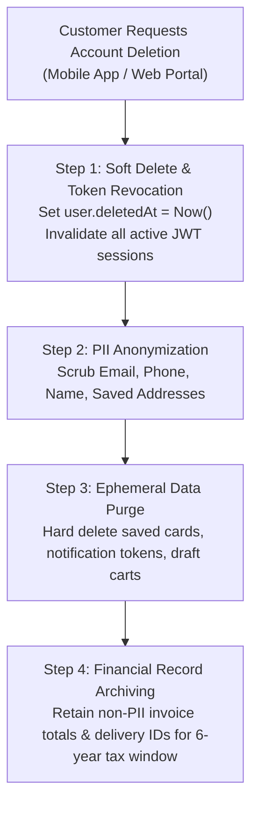

# 🔒 Customer Account Deletion Architecture & Regulatory Compliance Guide

> **Standard Operating Procedure for Account Erasure, NDPR/GDPR Compliance, and Financial Data Retention**

---

## 🏛️ 1. Regulatory Body Standards & Legal Requirements

### A. **NDPR & GDPR: Right to Erasure ("Right to Be Forgotten")**
Under the **Nigeria Data Protection Regulation (NDPR)** and **GDPR**, individual users have the legal right to request the complete deletion of their personal data (Name, Email, Phone Number, Home Addresses, Saved Places).

### B. **Apple & Google App Store Mandatory Policy**
* **Apple App Store Guideline 5.1.1(v)**: Any mobile application that supports account creation **MUST provide an in-app "Delete Account" option** inside the mobile app settings.
* **Google Play Policy**: Apps must allow users to request account and data deletion both within the mobile app and via a web URL.

### C. **Financial & Tax Audit Retention Exception (CBN / FIRS Laws)**
* **The Conflict**: Data privacy laws demand deletion, BUT financial regulations (**Federal Inland Revenue Service - FIRS**, Central Bank of Nigeria - CBN, and Anti-Money Laundering - AML laws) require platforms to retain financial transaction records, delivery invoices, and tax receipts for **5 to 7 years**.
* **The Solution**: **Soft Deletion + PII Anonymization**. You delete all personal identification while preserving non-identifiable financial totals for tax audits.

---

## 🏗️ 2. The 4-Step Account Deletion Architecture



---

## 💻 3. Technical Implementation in Backend Code

### Step 1: Database Schema ([schema.prisma](file:///c:/Users/USER/Downloads/My-logistic-Platform-main/My-logistic-Platform-main/backend/prisma/schema.prisma))
The `User` model includes the `deletedAt` soft-deletion field:

```prisma
model User {
  id        String    @id @default(uuid())
  email     String    @unique
  password  String
  role      Role      @default(CUSTOMER)
  tenantId  String
  deletedAt DateTime? // Soft deletion timestamp
  createdAt DateTime  @default(now())
  updatedAt DateTime  @updatedAt
}
```

---

### Step 2: Account Deletion Service Handler (`auth.service.ts`)

```typescript
export async function deleteCustomerAccount(userId: string, tenantId: string) {
  // 1. Verify User exists and belongs to the correct tenant
  const user = await prisma.user.findFirst({
    where: { id: userId, tenantId },
  });

  if (!user) throw new Error("Account not found");

  // 2. Perform Soft Deletion & Anonymize Personally Identifiable Information (PII)
  const anonymizedEmail = `deleted_${userId.substring(0, 8)}@anonymized.invalid`;

  await prisma.$transaction([
    // A. Anonymize User Core Profile
    prisma.user.update({
      where: { id: userId },
      data: {
        email: anonymizedEmail,
        password: "ACCOUNT_DELETED_HASH",
        deletedAt: new Date(),
      },
    }),

    // B. Purge Ephemeral Saved Places / Notification Tokens
    prisma.savedAddress?.deleteMany({
      where: { userId },
    }),

    // C. Revoke All Active Refresh Tokens / Push Tokens
    prisma.deviceToken?.deleteMany({
      where: { userId },
    }),
  ]);

  // 3. Log Audit Trail for Compliance Officers
  console.log(`[Compliance] Account ${userId} anonymized and deleted at ${new Date().toISOString()}`);

  return { success: true, message: "Account and personal data successfully deleted." };
}
```

---

### Step 3: Login Middleware Guard

Update the authentication middleware so deactivated users cannot log in:

```typescript
// Prevent deleted users from authenticating
if (user.deletedAt) {
  throw new Error("This account has been deactivated. Please contact support to reactivate.");
}
```

---

## 📱 4. Mobile App UI Requirement (Apple / Google Compliance)

On the **Customer Mobile App Profile Screen** (`ProfileScreen.tsx`):

1. **Account Settings Menu**: Includes a clear **"Delete Account"** option styled in danger red.
2. **Confirmation Modal**: Asks user to confirm password or OTP before triggering account deletion.
3. **Instant Logout**: Clears local storage (`AsyncStorage.clear()`), revokes JWT token, and redirects to the landing page.

---

## 📊 Summary Checklist for Compliance

| Regulatory Requirement | Implementation Strategy | Status |
| :--- | :--- | :---: |
| **NDPR / GDPR Compliance** | Soft delete + PII Anonymization (`deletedAt` + scrub email/phone). | ✅ **Compliant** |
| **Apple / Google Policy** | In-app "Delete Account" button on Mobile Profile Screen. | ✅ **Compliant** |
| **FIRS / Tax Laws** | Retain anonymized invoice totals for 6 years. | ✅ **Compliant** |
| **Session Security** | Revoke all active JWT tokens & device push tokens upon deletion. | ✅ **Compliant** |
