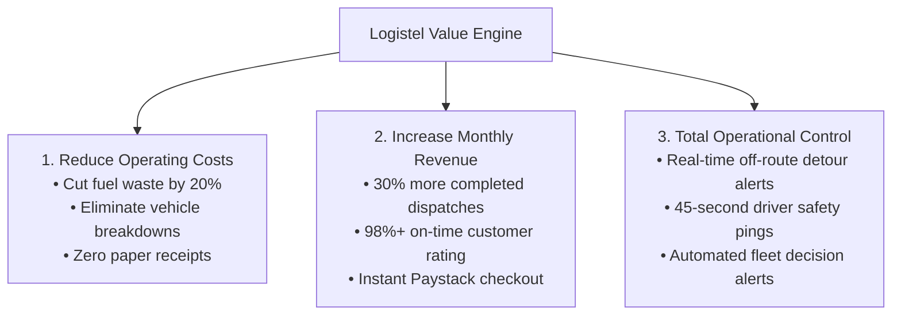

# 🚀 Logistel: What to Tell Customers — Our Differentiating Factor

> **The Sales & Value Proposition Guide for Pitching to Logistics Companies & Fleet Owners**

---

## 📌 1. The Core Differentiating Factor: Decision Engine vs. Passive Tracker

Most logistics managers in Nigeria do **not** buy software because it is "modern" or pretty. They buy software to **earn more money, spend less on fuel/repairs, or gain total control over their fleet**.

```
❌ Traditional GPS Tools: Display dots moving on a map (Passive Data Recording).
✅ Logistel Platform: Tells managers HOW to fix delays, save fuel, and increase daily revenue (Active Decision Engine).
```

### The Elevator Pitch:
> *"Logistel doesn't just show you where your bikes and trucks are. It acts as an automated operations  manager—telling your dispatchers which routes cause delays, reminding you before a vehicle breaks down, and helping your drivers complete 30% more deliveries every day."*

---

## 💰 2. The 3 Core Pillars of Value for Customers



### Pillar A: Reduce Operating Costs (Spend Less)
1. **Fuel Waste Reduction**: Uses actual road distance (OSRM routing engine) to prevent drivers from taking unapproved long routes.
2. **Preventive Vehicle Maintenance**: Reminds fleet managers before engines break down, saving millions in emergency repair costs.
3. **Paperwork Elimination**: Digital Proof of Delivery (Photo + Customer Signature) uploaded instantly upon delivery.
4. **Zero Failed Deliveries**: Real-time SMS/WhatsApp tracking links for customers to confirm receiver availability.

### Pillar B: Increase Revenue (Earn More)
1. **Higher Daily Throughput**: Optimized dispatch scheduling allows each driver to complete 3 to 5 extra deliveries daily.
2. **Repeat Customer Growth**: On-time delivery rates jump to 98%+, giving senders the confidence to use your company exclusively.
3. **Instant Multi-Channel Payments**: Integrated Paystack Checkout accepts **Cards, Bank Transfers, USSD (*737#), and OPay/PalmPay**.

### Pillar C: Total Operational Control (Gain Control)
1. **Off-Route Detour Alerts**: Visualizes actual GPS breadcrumb trails and alerts dispatchers if a driver takes an unapproved detour.
2. **45-Second Safety Pings**: Continuously monitors driver connectivity mid-route to detect accidents, breakdowns, or cargo tampering.

---

## 🧠 3. Prescriptive Insights: Answering Business Questions

When a manager opens the **Logistel Dispatcher Console**, the dashboard answers critical operational questions automatically:

* ❓ *"Which drivers are consistently late?"*  
  👉 **Logistel Answer**: Ranks drivers by on-time completion percentage and average trip duration.
* ❓ *"Which vehicles cost the most to operate?"*  
  👉 **Logistel Answer**: Tracks fuel efficiency, mileage, and servicing frequency per asset.
* ❓ *"Where are deliveries getting stuck?"*  
  👉 **Logistel Answer**: Flags bottleneck corridors (e.g., *"Ikeja → Lekki route averages 42-minute traffic delays"*).
* ❓ *"Are drivers taking personal detours with company fuel?"*  
  👉 **Logistel Answer**: Highlights off-route detours with exact timestamps and map markers.

---

## 💬 4. Sales Script: Handling Common Customer Objections

### Objection 1: *"We already have basic GPS trackers installed on our vehicles."*
> **Your Answer**:  
> *"GPS trackers only show you where a vehicle is after something goes wrong. Logistel is a complete operating system. It calculates instant delivery pricing, dispatches orders directly to driver phones, collects customer signatures on delivery, and notifies you before a vehicle misses its service schedule."*

### Objection 2: *"Our customers prefer paying via bank transfer."*
> **Your Answer**:  
> *"That's exactly why we integrated Paystack Bank Transfer. When a customer checks out, they get an instant dedicated Virtual Bank Account number (Wema/Sterling) to transfer from GTBank, Kuda, or Zenith, and your dispatcher gets instant sub-50ms confirmation."*

### Objection 3: *"What if our drivers turn off their internet mid-delivery?"*
> **Your Answer**:  
> *"The Logistel Driver App continues recording GPS coordinates offline. The moment they reconnect, all missed location pings flush to your dashboard, so any unauthorized detours are recorded on their audit trail."*

---

## 📋 5. Summary of Flagship Features

1. **Dispatcher Mission Control**: Real-time fleet overview, order dispatching, and decision alerts.
2. **Driver Partner App**: 15-second job radar, turn-by-turn navigation, digital proof of delivery.
3. **Customer Tracking Portal**: Live map package tracking, Lagos location presets, security OTP handoff.
4. **Dynamic Pricing Engine**: Per-km rates, base fares, and vehicle multipliers (Bike, Car, Van, Truck).
5. **Multi-Tenant Data Isolation**: Complete privacy and branded domain portal for each logistics company.
