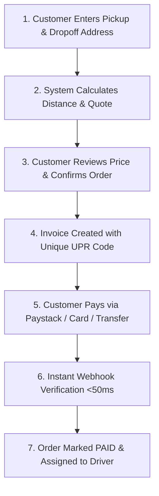

# 🚚 Customer Delivery Pricing & Charging Strategy Guide

> **Standard Operating Procedure & Technical Breakdown on How Customers are Charged for Deliveries on Logistel**

---

## 📌 Executive Summary

On the **Logistel Logistics Platform**, delivery pricing is dynamic, fair, transparent, and multi-tenant. Each logistics company (Tenant) has full autonomy to define their own pricing rules or rely on system-recommended defaults.

When a customer or dispatcher requests a delivery, the system calculates the price **instantly** based on **three core variables**:
1. **Base Fare** (Fixed baseline booking fee)
2. **Geographical Distance** (Distance in km between pickup and dropoff points)
3. **Vehicle Type Multiplier** (Bike, Car, Van, or Heavy Truck)

---

## 📐 1. The 3 Core Components of Delivery Pricing

```
┌───────────────────────────────────────────────────────────────────────────────────┐
│                                                                                   │
│   TOTAL PRICE = ( Base Fare  +  [ Distance (km) × Per-KM Rate ] ) × Multiplier    │
│                                                                                   │
└───────────────────────────────────────────────────────────────────────────────────┘
```

### Component A: Base Fare (Baseline Fee)
* **What it is:** The fixed starting charge applied to every order regardless of distance.
* **Purpose:** Covers administrative overhead, driver dispatch allocation, and baseline processing costs.
* **Default Value:** **₦1,000** (Customizable per company).

### Component B: Distance Charge (Per-KM Rate)
* **What it is:** The rate charged per kilometer traveled from pickup to dropoff.
* **How Distance is Measured:** Calculated using the **Haversine Formula** (exact geo-coordinate math between pickup `(lat1, lon1)` and dropoff `(lat2, lon2)`).
* **Default Value:** **₦100 / km** (Customizable per company).

### Component C: Vehicle Type Multiplier
* **What it is:** A scaling factor applied based on the capacity, fuel consumption, and operational cost of the selected vehicle.
* **Multiplier Table:**

| Vehicle Type | Multiplier | Recommended Use Case |
| :--- | :---: | :--- |
| 🚴 **Bike (Motorcycle)** | **1.0x** (100%) | Small documents, food orders, light parcels (< 15 kg) |
| 🚗 **Car (Sedan/Hatchback)** | **1.2x** (120%) | Medium packages, fragile goods, multi-box deliveries |
| 🚐 **Van (Cargo Van)** | **1.5x** (150%) | Furniture, bulk retail orders, heavy cargo |
| 🚛 **Truck (Freight Truck)** | **2.5x** (250%) | Pallets, construction material, industrial equipment |

---

## 🧮 2. Step-by-Step Calculation Examples

### Example Scenario 1: Short City Delivery via Bike 🚴
* **Distance:** 5 km
* **Base Fare:** ₦1,000
* **Per-KM Rate:** ₦100/km
* **Vehicle:** Bike (`1.0x`)

$$\text{Subtotal} = \text{₦1,000} + (5 \text{ km} \times \text{₦100}) = \text{₦1,000} + \text{₦500} = \text{₦1,500}$$
$$\text{Total Price} = \text{₦1,500} \times 1.0 = \mathbf{₦1,500}$$

---

### Example Scenario 2: Medium Delivery via Cargo Van 🚐
* **Distance:** 20 km
* **Base Fare:** ₦1,000
* **Per-KM Rate:** ₦100/km
* **Vehicle:** Van (`1.5x`)

$$\text{Subtotal} = \text{₦1,000} + (20 \text{ km} \times \text{₦100}) = \text{₦1,000} + \text{₦2,000} = \text{₦3,000}$$
$$\text{Total Price} = \text{₦3,000} \times 1.5 = \mathbf{₦4,500}$$

---

### Example Scenario 3: Inter-State / Long-Distance via Truck 🚛
* **Distance:** 50 km
* **Base Fare:** ₦1,000
* **Per-KM Rate:** ₦150/km *(Custom company rate)*
* **Vehicle:** Truck (`2.5x`)

$$\text{Subtotal} = \text{₦1,000} + (50 \text{ km} \times \text{₦150}) = \text{₦1,000} + \text{₦7,500} = \text{₦8,500}$$
$$\text{Total Price} = \text{₦8,500} \times 2.5 = \mathbf{₦21,250}$$

---

## 💳 3. How the Customer Charging Process Works End-to-End



### Step 1: Instant Quote Generation
Before committing to any order, the customer sees an explicit breakdown of:
- Estimated distance in km
- Vehicle type chosen
- Total calculated delivery charge in Naira (₦)

### Step 2: Invoice Creation & Unique Payment Reference (UPR)
When the customer confirms the order, the system generates an official Invoice containing a **Unique Payment Reference (UPR)**:
- **Format:** `LOG-{TENANT_SUBDOMAIN}-{YYMM}-{HEX_CODE}`
- **Example:** `LOG-DAMILAREMICHAELS-2609-A4B12C`

### Step 3: Payment Processing
Customers can pay via:
- **Debit/Credit Cards** (Mastercard, Visa, Verve)
- **Bank Transfer** (Instant Virtual Bank Account)
- **USSD / Mobile Money**

### Step 4: Real-time Settlement & Driver Dispatch
- Once Paystack confirms payment, a secure **HMAC SHA512 Webhook** updates the invoice status to `PAID`.
- Real-time WebSockets instantly notify the company dispatcher dashboard and notify nearby available drivers.

---

## ⚙️ 4. How Logistics Company Owners Can Customize Their Pricing

Logistics company admins can adjust their pricing rates at any time directly from the **Company Admin Dashboard**:

1. Log into your **Company Dashboard** (`/tenant-owner/dashboard`).
2. Navigate to **Pricing & Revenue Settings**.
3. Adjust your preferred parameters:
   - Change **Base Fare** (e.g., set to ₦1,500 for premium service).
   - Change **Per-KM Rate** (e.g., set to ₦120/km during fuel price increases).
   - Adjust **Vehicle Multipliers** (e.g., increase Truck multiplier to `3.0x`).
4. Click **Save Pricing Rules**. All future delivery quotes generated for your company will immediately use your updated pricing rules!

---

## 📚 5. Additional Documentation Links

* 🛡️ [Security & Webhook Verification Architecture](file:///c:/Users/USER/Downloads/My-logistic-Platform-main/My-logistic-Platform-main/docs/guides/security_architecture.md)
* 🗺️ [Map & GPS Tracking Architecture](file:///c:/Users/USER/Downloads/My-logistic-Platform-main/My-logistic-Platform-main/docs/guides/map_and_tracking_architecture.md)
* 💳 [Paystack Integration & Payments Technical Guide](file:///c:/Users/USER/Downloads/My-logistic-Platform-main/My-logistic-Platform-main/docs/guides/pricing_and_payments.md)
* 🔒 [Regulatory & Account Compliance](file:///c:/Users/USER/Downloads/My-logistic-Platform-main/My-logistic-Platform-main/docs/ACCOUNT_DELETION_AND_REGULATORY_COMPLIANCE.md)
