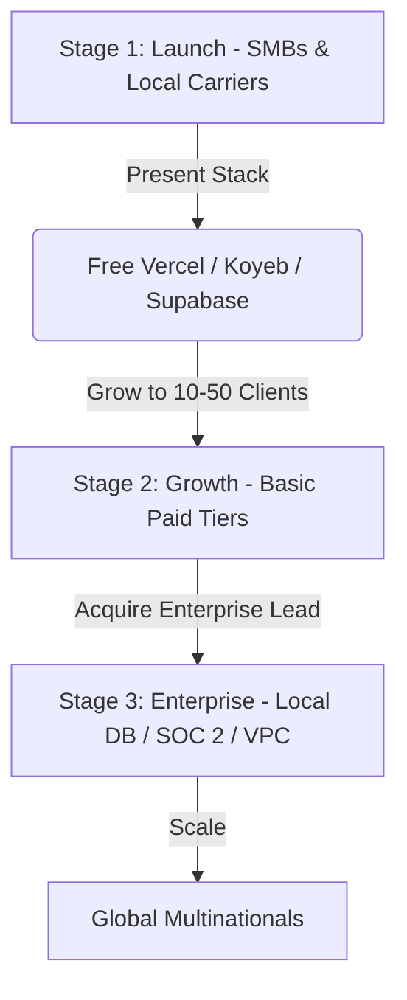

# Customer Ceiling & Compliance Strategy Guide

This document outlines the **Customer Ceiling** for the Logistel platform. Our customer ceiling defines the maximum organizational scale, compliance complexity, and security threshold of clients we can sell our software to today, based on our current infrastructure choices.

---

## 1. Core Concept: What is a "Customer Ceiling"?

A **Customer Ceiling** represents the limit on the size and type of customers your business can legally and technically serve, defined by your technical infrastructure choices.

When building a SaaS application (like Logistel), we use convenient, managed platforms (Vercel, Supabase, Koyeb, Render). These tools are excellent for getting started, but they set a compliance ceiling. 

Large corporations, banks, and government agencies have strict IT Procurement teams that will reject public, shared, free-tier setups. To serve them eventually, we must raise our ceiling over time.

---

## 2. Our Staged Evolution Roadmap

We will scale the infrastructure in **three distinct stages** to avoid premature optimization and unnecessary hosting costs.

### Stage 1: The Launch Stage (Current Phase — Cost: ₦0)
* **Infrastructure**: Vercel (Hobby / Free), Koyeb/Render (Free Tier), Supabase (Free Shared PostgreSQL).
* **Target Audience**: Local courier startups, merchant retailers, regional pharmacies, and small dispatch networks in Lagos (1–20 vehicles).
* **Their Needs**: Uptime, reliable OTP delivery handoffs, basic maps, and accurate bookings. They do not care about compliance certificates.
* **Focus**: Product validation, bug squashing, and customer satisfaction.

### Stage 2: The Growth Stage (Cost: Approx. $10 - $20 / Month)
* **Infrastructure**: Basic paid tiers of Koyeb/Render and Supabase.
* **Target Audience**: Mid-market fleets with 50+ vehicles or multiple regional offices.
* **Action**: Upgrade to dedicated databases with automated daily backups and higher API rate limits.
* **Focus**: Scaling traffic and handling larger daily delivery volumes.

### Stage 3: The Enterprise Stage (Cost: Paid for by Clients)
* **Infrastructure**: Dedicated virtual servers (AWS/GCP), localized databases, single-tenant private cloud deployments.
* **Target Audience**: Multinational carriers, banks, public institutions, and large conglomerates (e.g., Jumia, DHL, banks).
* **Action**:
  1. **Data Residency**: Host databases inside Nigeria (e.g., local rack centers) to comply with NDPR regulations.
  2. **Security Audits**: Automated compliance reports (SOC 2 Type II / ISO 27001) using Vanta/Drata.
  3. **VPC Deployment**: Package backend into Docker containers for deployment within the client's corporate cloud.
* **Focus**: Legal compliance, enterprise contracts, and dedicated SLAs.

---

## 3. Preparation Strategy (Zero Cost Today)

To ensure we can transition from Stage 1 to Stage 3 rapidly if a large corporate client approaches us, we will:
1. **Containerize the App (Docker)**: Write standard `Dockerfile` configurations so the entire app can be run locally or inside a private cloud instantly.
2. **Audit Logging**: Maintain clean user and system logs so that security teams can easily inspect database audit trails.
3. **Database Row-Level Security**: Ensure all tables check `tenant_id` queries, ensuring complete separation of company data.
