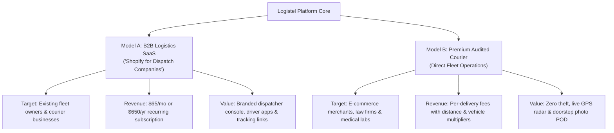

# 🎯 Ideal Customers, Competitive Advantage & Go-To-Market Blueprint

> **A Strategic Business & Product-Market Fit Guide: Identifying high-value customer segments, articulating our unfair advantages over competitors, and securing the first 10 paying accounts.**

---

## 🧭 Table of Contents
1. [Executive Summary: Who Are We & What Do We Sell?](#1-executive-summary-who-are-we--what-do-we-sell)
2. [The Two Revenue Models (Pick Your Strategic Lane)](#2-the-two-revenue-models-pick-your-strategic-lane)
3. [The 3 Ideal Customer Profiles (ICPs)](#3-the-3-ideal-customer-profiles-icps)
4. [Competitive Landscape: Why Competitors Fail Them](#4-competitive-landscape-why-competitors-fail-them)
5. [Our 4 Unfair Advantages (Why Customers Choose Us)](#5-our-4-unfair-advantages-why-customers-choose-us)
6. [The 30-Second Elevator Pitch & Sales Scripts](#6-the-30-second-elevator-pitch--sales-scripts)
7. [The "First 10 Customers" Action Playbook](#7-the-first-10-customers-action-playbook)

---

## 1. Executive Summary: Who Are We & What Do We Sell?

Most delivery platforms compete purely on being "cheap" and end up in a race to the bottom with low margins, stolen packages, and dissatisfied customers. 

**Logistel is built differently.** Through our custom-engineered multi-tenant architecture, cryptographic OTP handoffs, tamper-proof GPS telemetry breadcrumbs, and digital proof-of-delivery (POD) photo signatures, we provide **bank-grade reliability and audited chain of custody**.

We do not just move boxes; we **guarantee delivery integrity and eliminate package theft**.

---

## 2. The Two Revenue Models (Pick Your Strategic Lane)

Our codebase supports two powerful business avenues:



### Model A: "Shopify for Logistics" (B2B SaaS Platform)
* **Who pays you:** Independent courier operators, dispatch startups, and e-commerce fulfillment hubs.
* **Their pain point:** Managing drivers over WhatsApp, voice notes, and paper manifests is chaotic. Custom software agencies charge $30,000+ and 9 months to build what we already have.
* **Our solution:** For **$65/month** (handled via our Paystack subscription billing engine), they get an instant, white-label dispatcher dashboard, driver consoles, customer tracking portals, and billing tools under their own subdomains.

### Model B: The "Premium Audited Courier" (Direct Operations)
* **Who pays you:** Shippers sending high-value, fragile, or urgent consignments.
* **Their pain point:** Gig-economy apps (Gokada, Kwik, random dispatch riders) frequently lose parcels, deliver to wrong addresses, or have drivers steal expensive inventory.
* **Our solution:** 100% verified chain of custody with OTP verification, Cloudflare R2 photos, digital signatures, and live street-level OSRM tracking.

---

## 3. The 3 Ideal Customer Profiles (ICPs)

If you are running courier operations directly, target these three segments first:

| Customer Segment | What They Ship | Their Greatest Fear / Pain | Why They Will Pick Us |
|---|---|---|---|
| **1. High-Value Social Commerce & Boutiques**<br/>*(Instagram, Shopify, luxury vendors)* | Wigs, smartphones, jewelry, custom cakes, designer shoes | Rider claims package was delivered, recipient denies receiving it. Merchant loses ₦100,000+. | **OTP Security Lock + Doorstep Photo + Signature**. Package handoff cannot close without the recipient's secret 6-digit code. |
| **2. Corporate & Professional Services**<br/>*(Law firms, embassies, audit firms, real estate)* | Legal briefs, court summons, contracts, tenders, passports | Unregulated drivers, no proof of time of service, lost sensitive documents, no official invoice. | **Digital Audit Trail**: Immutable `LocationBreadcrumb` GPS trail, automated PDF invoices, and instant timestamped delivery certificates. |
| **3. Medical Labs & Perishables**<br/>*(Diagnostic centers, pharmacies, cold chain)* | Blood/tissue samples, sensitive reagents, specialized meds | Unpredictable delays in traffic; samples spoil before reaching the testing lab. | **Calibrated OSRM vehicle routing, live telematics radar**, and multi-vehicle options (Cars & Refrigerated Vans, not just bikes). |

---

## 4. Competitive Landscape: Why Competitors Fail Them

| Competitor Type | Their Weakness | How Logistel Wins |
|---|---|---|
| **Gig-Economy Apps**<br/>*(e.g., Kwik, Gokada, Bolt Send)* | 1. 20–30% heavy commission fees.<br/>2. Anonymous riders with zero accountability.<br/>3. Almost exclusively motorbikes (cannot take big boxes or fragile cakes).<br/>4. Poor dispute resolution when packages vanish. | 1. Direct verified fleet with rigorous driver verification.<br/>2. Multi-vehicle choices: **Bike, Car, Van, Truck**.<br/>3. Cryptographic OTP and photo proof guarantee receipt.<br/>4. Continuous telemetry radar prevents driver detours. |
| **Traditional Express Couriers**<br/>*(e.g., DHL, FedEx, Red Star)* | 1. Slow intra-city service (takes 24–48 hours for local deliveries).<br/>2. Extremely expensive pricing for short distances.<br/>3. Clunky, outdated portals with delayed tracking updates. | 1. **Same-hour on-demand dispatch** across the city.<br/>2. Real-time street-level tracking updated every 4 seconds.<br/>3. Modern, transparent distance-based pricing. |
| **Informal Dispatch Riders**<br/>*(Random riders found on WhatsApp/Instagram)* | 1. Constant price haggling: *"Oga add ₦2,000 because of rain and fuel."*<br/>2. No live map tracking.<br/>3. Zero compensation if the rider disappears with items. | 1. Fixed, automated distance-based billing.<br/>2. Live interactive web tracking link for both sender and recipient.<br/>3. Professional institutional trust. |

---

## 5. Our 4 Unfair Advantages (Why Customers Choose Us)

### 🔐 1. Zero-Theft Handshake (The OTP & POD Shield)
A delivery on our platform **physically cannot be marked as delivered** until:
1. The driver collects the confidential 6-digit OTP code sent exclusively to the recipient.
2. The driver snaps a dropoff photo of the parcel (persisted on Cloudflare R2 storage).
3. The recipient signs digitally on the driver's phone screen.
4. The driver's live GPS coordinates match within 300 meters of the customer's doorstep.

### 🚗 2. Multi-Vehicle Fleet Flexibility (Not Just Bikes)
Most city courier services are 95% bikes. When a client needs to transport 8 bulk cartons, a wedding cake, or an office generator, other apps fail.
* **Bike:** Fast document & food delivery through dense city gridlock.
* **Car / Sedan:** Fragile items, cakes, expensive electronics that cannot be rained on.
* **Van:** E-commerce bulk distribution and merchant restocking.
* **Truck:** Palletized cargo, industrial goods, and warehouse moves.

### 📍 3. Telemetry Radar & Cargo Diversion Investigation
Our backend logs an immutable, append-only GPS trail to `LocationBreadcrumb` on every ping.
* If a driver deviates off-route or makes unauthorized stops, the system flags it.
* In the event of any customer dispute, dispatchers have an exact minute-by-minute playback of where the cargo was at all times.

### 💰 4. Predictable, Metered Distance Billing
No guessing, no arguing. The pricing engine computes distance via exact road geometry (OSRM), applies the tenant's base rates and vehicle multipliers, and produces a transparent invoice before payment.

---

## 6. The 30-Second Elevator Pitch & Sales Scripts

### Pitch A: For High-Value E-Commerce Merchants (Instagram / Boutique Sellers)
> *"I noticed you ship high-end fashion and gadgets across the city. How often do dispatch riders delay your packages, or customers claim they never received their order?*  
>  
> *With our platform, package theft is mathematically eliminated: your customer receives a secret 6-digit OTP code that the rider must enter to complete the delivery, along with a doorstep photo and digital signature sent straight to your phone in real time. Try us for your next 3 fragile shipments—if you don't get absolute peace of mind, the deliveries are on us."*

### Pitch B: For Corporate & Professional Firms (Law, Accounting, Diagnostics)
> *"Most courier services operate like informal gig-workers without audit trails. We provide enterprise-grade city logistics: instant formal invoices, minute-by-minute GPS audit logs proving exact chain of custody, and dedicated multi-vehicle fleets from motorbikes to cargo vans. We handle your confidential dispatches with institutional accountability."*

### Pitch C: For Independent Logistics Fleet Owners (SaaS Model)
> *"Are you still managing your dispatch fleet through chaotic WhatsApp chats and spreadsheets? We give you your own branded logistics operating system—complete with a live dispatcher map, automated driver assignment, turn-by-turn driver navigation, and Paystack card payments—for just $65 a month. You look like DHL tomorrow morning."*

---

## 7. The "First 10 Customers" Action Playbook

Do not spend money on paid Facebook/Google ads at the beginning. Follow this direct, zero-cost 7-day plan:

```
┌────────────────────────────────────────────────────────────────────────┐
│                      7-Day First 10 Customer Sprint                    │
├─────────┬──────────────────────────────────────────────────────────────┤
│ Day 1-2 │ Map 20 boutique merchants & pharmacies within 5km of your hub│
│ Day 3-4 │ In-person visits: Demo the live tracking link & OTP canvas   │
│ Day 5   │ Offer the "Zero-Risk Pilot" (First 3 deliveries guaranteed)  │
│ Day 6   │ Execute flawless deliveries with prompt photo POD receipts   │
│ Day 7   │ Collect video testimonials & convert them into weekly accounts│
└─────────┴──────────────────────────────────────────────────────────────┘
```

1. **Identify High-Value Concentrations**: Walk into local clusters (malls, electronics plazas, medical diagnostic centers, cake/pastry bakeries).
2. **Bring the Interactive Demo**: Open your phone, book a quick test order, and show them the live map tracking, driver ETA, and signature pad. Seeing the technology live creates immediate trust.
3. **The "Zero-Risk" Offer**: *"Give us your next 3 deliveries today. You get live tracking and digital proof of delivery. If anything goes wrong or isn't 100% on time, you pay ₦0."*
4. **Follow Up with Proof**: Send the merchant the completed POD photo and digital signature receipt over WhatsApp immediately after delivery. They will never want to go back to informal riders.
