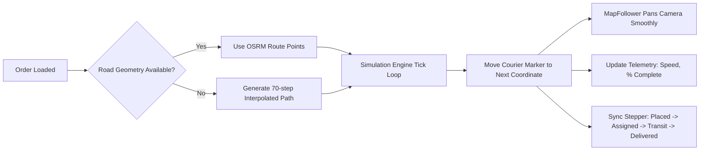

    # 🗺️ Logistel Maps & Live Tracking Architecture Guide

This document is the comprehensive reference guide for everything related to **mapping, GPS telemetry, real-road routing, and live tracking simulation** in the **Logistel Logistics Platform**.

---

## 1. Executive Summary & Technology Stack

Logistel uses an enterprise-grade, open-source geospatial stack designed for high performance, zero licensing fees, and instant global availability:

| Layer | Technology | Purpose | Cost / License |
| :--- | :--- | :--- | :--- |
| **Map Rendering** | `Leaflet` + `react-leaflet` | Interactive map canvas (zoom, pan, popups, custom markers) | Free (BSD-2-Clause) |
| **Map Tile Server** | OpenStreetMap (OSM) | Street-level satellite & vector tiles of the entire globe | 100% Free / Open Data |
| **Road Routing** | OSRM (Open Source Routing Machine) | Real turn-by-turn road networks, driving routes & travel time | Free Open API |
| **Real-Time Transport** | `Socket.io` (WebSockets) | Sub-second GPS telemetry push from driver phones | Free / Open Source |
| **Historical Auditing** | PostgreSQL (`LocationBreadcrumb`) | Anti-theft diversion tracking and historical route playback | Stored in Neon DB |

### Why OpenStreetMap & Leaflet Instead of Google Maps?
1. **Zero Billing Surprises:** Google Maps charges ~$7 per 1,000 route requests and $5 per 1,000 map loads, which can cost thousands of dollars monthly at scale. Logistel's Leaflet + OSM architecture runs **100% free**.
2. **No API Keys or Credit Cards Required:** The platform deploys and works immediately out of the box.
3. **Full Customizability:** Marker styling, animations, smooth camera tracking, and custom vehicle overlays can be manipulated directly with CSS and HTML.

---

## 2. The Core Components

### A. Coordinate System & Geographic Anchors
Every shipment in Logistel is pinned to geographic coordinates:
* `pickupLatitude`, `pickupLongitude`: Origin point where cargo is collected.
* `dropoffLatitude`, `dropoffLongitude`: Final customer destination.
* `actualDropoffLatitude`, `actualDropoffLongitude`: Recorded at the moment of proof-of-delivery handoff (geofence audit).

#### Common Nigerian Test Benchmark Coordinates:
| Location | Latitude | Longitude | Common Role |
| :--- | :--- | :--- | :--- |
| **Ikeja City Mall** | `6.6018` | `3.3515` | Mainland Hub / Pickup |
| **Surulere Mall** | `6.5020` | `3.3580` | Central Lagos Origin |
| **Yaba (Herbert Macaulay)** | `6.5182` | `3.3769` | Commercial Destination |
| **Victoria Island** | `6.4281` | `3.4219` | Island Delivery Hub |
| **Lekki Phase 1** | `6.4474` | `3.4723` | Residential Destination |

---

### B. OSRM Road Routing Engine (`useOsrmRoute.ts`)
Instead of drawing a straight "as-the-crow-flies" line across water and buildings, Logistel queries the **OSRM Road Network API**:

```typescript
const osrmUrl = `https://router.project-osrm.org/route/v1/driving/${pickupLng},${pickupLat};${dropoffLng},${dropoffLat}?overview=full&geometries=geojson`;
```

* **Inputs:** `[Pickup Longitude, Latitude]` and `[Dropoff Longitude, Latitude]`
* **Outputs:**
  * `routeCoords`: An array of hundreds of `[lat, lng]` points outlining every street curve, turn, and bridge.
  * `distanceKm`: The precise driving distance along legal roadways (used for price quotes).
  * `durationMins`: Estimated drive time in standard traffic.
* **Fallback Mode:** If the OSRM server is temporarily slow or coordinates are off-road, the map gracefully falls back to a dashed cyan straight-line corridor until real road data arrives.

---

### C. Map Markers & Visual Hierarchy

The map uses a three-tier visual color hierarchy:

1. **🔵 Blue Marker (`pickupIcon`):**
   * Pinned to `[pickupLatitude, pickupLongitude]`.
   * Stays fixed as the pickup station/warehouse address.
2. **🟢 Green Marker (`dropoffIcon`):**
   * Pinned to `[dropoffLatitude, dropoffLongitude]`.
   * Stays fixed as the customer's delivery destination.
3. **🛵 Animated Courier Marker (`liveCourierIcon`):**
   * Rendered using a dynamic Leaflet `DivIcon`.
   * Features a pulsating cyan radar ping ring (`animate-ping`) and vehicle badge (`🛵`).
   * Moves dynamically across the road during live dispatches or simulations.
   * Clicking the marker displays live telemetry (driver name, license plate, speed in km/h, and trip progress %).

---

## 3. The Live Courier Drive Simulation Engine

Built directly into [`PublicTrackingPage.tsx`](file:///c:/Users/USER/Downloads/My-logistic-Platform-main/My-logistic-Platform-main/admin-dashboard/src/features/tracking/pages/PublicTrackingPage.tsx), the simulation engine allows operators, clients, and partners to visualize real shipments moving before physical drivers are dispatched.

### How It Works:



#### Key Controls:
* **`▶ Simulate Live Drive` / `⏸ Pause Courier`**: Starts or halts the vehicle tick timer.
* **Speed Multipliers (`1x`, `2x`, `4x`)**: Adjusts the interval from 130ms per step down to 30ms for rapid presentations.
* **`Follow 🎯` Button**: Uses Leaflet's `useMap().panTo(coords)` to smoothly float the camera alongside the courier.
* **`↺ Reset` Button**: Returns the vehicle to the starting warehouse.

#### Dynamic Stepper Synchronization:
As the simulated vehicle travels along the polyline, it automatically triggers lifecycle milestones:
* **0% – 14%:** `PENDING` (Order Placed)
* **15% – 34%:** `ASSIGNED` (Courier Assigned to Pickup)
* **35% – 49%:** `PICKED_UP` (Cargo Collected)
* **50% – 99%:** `IN_TRANSIT` (Out on the Highway for Delivery)
* **100%:** `DELIVERED` (Courier reaches Green Pin; triggers celebration toast and verified arrival state).

---

## 4. Real-World Driver GPS Integration (Production Flow)

When transitioning from the simulator to actual drivers on the road:

1. **Driver Mobile / Web App:**
   * The driver's device calls `navigator.geolocation.watchPosition()`.
   * Every 5–10 seconds, it sends a WebSocket packet to the backend:
     ```json
     {
       "event": "driver:location_update",
       "data": {
         "driverId": "61a4ffdd-98e4-4b0e-a296-c98395af7384",
         "deliveryId": "c65110b7-3772-4232-860e-e594583ab348",
         "latitude": 6.5085,
         "longitude": 3.3620,
         "speed": 43.5
       }
     }
     ```
2. **Backend Engine ([`tracking.socket.ts`](file:///c:/Users/USER/Downloads/My-logistic-Platform-main/My-logistic-Platform-main/backend/src/api/v1/modules/tracking/tracking.socket.ts)):**
   * Broadcasts the update to the tracking room: `delivery:${deliveryId}`.
   * Inserts an audit record into the `LocationBreadcrumb` table in PostgreSQL.
3. **Customer & Admin Dashboards:**
   * Automatically updates `driver.latitude` and `driver.longitude`, gliding the vehicle marker across the customer's screen in real time.

---

## 5. Where Maps Are Implemented in the Codebase

| Page / Component | File Path | Map Usage |
| :--- | :--- | :--- |
| **Public Tracking Portal** | [`PublicTrackingPage.tsx`](file:///c:/Users/USER/Downloads/My-logistic-Platform-main/My-logistic-Platform-main/admin-dashboard/src/features/tracking/pages/PublicTrackingPage.tsx) | Live public package tracking, OSRM turn-by-turn route, live courier drive simulation |
| **Tenant Dispatcher Hub** | [`TenantDashboardPage.tsx`](file:///c:/Users/USER/Downloads/My-logistic-Platform-main/My-logistic-Platform-main/admin-dashboard/src/features/dashboard/pages/TenantDashboardPage.tsx) | Full-fleet dispatch map, active vehicle cluster monitoring, breadcrumb route audit trails |
| **Customer Portal** | [`CustomerDashboardPage.tsx`](file:///c:/Users/USER/Downloads/My-logistic-Platform-main/My-logistic-Platform-main/admin-dashboard/src/features/dashboard/pages/CustomerDashboardPage.tsx) | Live tracking of customer's inbound orders with route corridor |
| **Driver Console** | [`DriverDashboardPage.tsx`](file:///c:/Users/USER/Downloads/My-logistic-Platform-main/My-logistic-Platform-main/admin-dashboard/src/features/dashboard/pages/DriverDashboardPage.tsx) | Navigation screen guiding the driver from current GPS location to dropoff |

---

## 6. Testing & Demo Links

You can test live mapping anytime using these pre-seeded tracking codes:

* **Assigned Courier on Route (Surulere ➔ Yaba):**  
  👉 `https://logistel-frontend.onrender.com/track/542381`
* **New Mainland Shipment (Ikeja ➔ Victoria Island):**  
  👉 `https://logistel-frontend.onrender.com/track/005d5835-01e8-4382-a8ae-f6178864b367`
* **General Search Portal:**  
  👉 `https://logistel-frontend.onrender.com/track`
