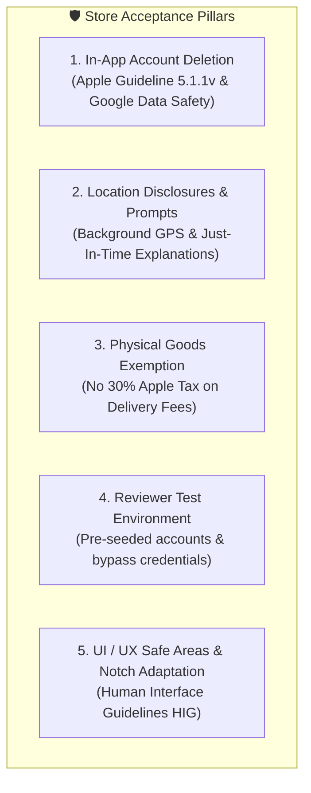
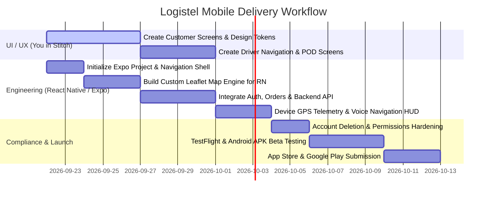

# 📱 Logistel Mobile App: Master Architecture, Store Compliance & Roadmap Guide

> **A Comprehensive Engineering Blueprint for the React Native (Expo) Mobile Application: Apple App Store & Google Play Acceptance, Custom Zero-Cost Maps, iOS/Android Testing Workflows, and Implementation Phases.**

---

## 🧭 Table of Contents
1. [Executive Summary & Development Strategy](#1-executive-summary--development-strategy)
2. [Store Acceptance & Anti-Rejection Checklist (Apple & Google)](#2-store-acceptance--anti-rejection-checklist-apple--google)
3. [Technology Stack & Core Architecture](#3-technology-stack--core-architecture)
4. [Custom Map Architecture in React Native (Solid & Zero Licensing)](#4-custom-map-architecture-in-react-native)
5. [Demystifying the Apple / iOS Development & Testing Journey](#5-demystifying-the-apple--ios-development--testing-journey)
6. [Android Development & Testing Journey](#6-android-development--testing-journey)
7. [Step-by-Step Implementation Flow (While Stitch Designs Are in Progress)](#7-step-by-step-implementation-flow)

---

## 1. Executive Summary & Development Strategy

We already have an enterprise-grade backend (Node.js/Express, Prisma, PostgreSQL/Neon, WebSockets) and a full-featured web operations dashboard. 

The mobile app will serve our two most critical handheld user personas:
1. **The Customer / Sender App:** Instant price quote, booking a delivery, live package tracking on road maps, proof-of-delivery receipts, and notification center.
2. **The Driver / Courier Console:** Available dispatch pool acceptance, active delivery manifest, turn-by-turn road navigation with audio HUD, in-app recipient calling/WhatsApp, and Proof-of-Delivery (POD) digital signature + photo capture.

While you are creating the visual screens and components in **Stitch**, this document establishes the technical, architectural, and store-compliance foundations so that **no code is wasted and the app passes App Store and Google Play inspection on the very first submission**.

---

## 2. Store Acceptance & Anti-Rejection Checklist (Apple & Google)

Both Apple (App Store Review Guidelines) and Google (Google Play Policy Center) reject hundreds of logistics and delivery apps every month due to standard pitfalls. Below is our blueprint to make Logistel 100% compliant:



### A. Mandatory In-App Account Deletion (Apple Guideline 5.1.1(v) & Google Play)
* **The Rule:** If an app allows creating an account, it **MUST allow the user to initiate account deletion directly within the mobile app**. It cannot just be an email link or support ticket.
* **Our Ready Solution:** We already engineered the NDPR/GDPR backend architecture (see [`ACCOUNT_DELETION_AND_REGULATORY_COMPLIANCE.md`](file:///c:/Users/USER/Downloads/My-logistic-Platform-main/My-logistic-Platform-main/docs/ACCOUNT_DELETION_AND_REGULATORY_COMPLIANCE.md)). The mobile settings screen will feature a clear `"Delete My Account"` flow with confirmation modals, triggering our soft-delete + PII scrubbing API.

### B. Location Permissions (The #1 Rejection Trap for Logistics Apps)
* **The Trap:** If an app asks for *"Always Allow / Background Location"* right after launch without explanation, Apple and Google will **instantly reject it**.
* **The Standard Compliant Flow:**
  1. **Two-Stage Custom Permission Primer:** Before showing the system dialog, show a custom in-app modal explaining *why* location is needed:
     * *For Customers:* `"We use your location to auto-fill your pickup address and show nearby couriers."*
     * *For Drivers:* `"Logistel collects background location while on an active delivery to provide real-time tracking for customers and dispatchers, even when the screen is locked."*
  2. **Just-In-Time Request:** Only request foreground location when the customer opens the map or booking screen. Only request background location for drivers when they toggle **Online** or tap **Start Delivery**.
  3. **Provide `NSLocationWhenInUseUsageDescription` and `NSLocationAlwaysAndWhenInUseUsageDescription`** in `app.json` with descriptive English sentences.

### C. In-App Purchase Exemption (Physical Services)
* **The Rule:** Digital goods (ebooks, in-game gems, subscriptions) must use Apple/Google In-App Purchase (paying a 15–30% fee).
* **The Exemption:** Logistics, package transport, and food delivery represent **physical, real-world goods and services**. 
* **Outcome:** We are **100% legally allowed** to use Paystack, Flutterwave, Stripe, or direct card payments inside the mobile app without giving Apple or Google a 30% cut.

### D. Safe Area View & UI Polish (Apple HIG)
* Every screen must handle the iPhone Dynamic Island, camera notch, and bottom home indicator bar using `react-native-safe-area-context`.
* No content clipping, no invisible buttons beneath the navigation bar.

### E. App Store Reviewer Test Account
* When submitting to App Store Connect and Google Play Console, you must provide:
  * A test Customer account (e.g., `reviewer.customer@logistel.com` / password) with pre-seeded deliveries.
  * A test Driver account (e.g., `reviewer.driver@logistel.com` / password) with an active test trip.
  * A 30-second demo video demonstrating driver GPS tracking in case the reviewer is testing indoors at Apple's headquarters in Cupertino.

---

## 3. Technology Stack & Core Architecture

```
┌─────────────────────────────────────────────────────────┐
│                 React Native (Expo SDK 51+)             │
├──────────────────────────┬──────────────────────────────┤
│  Navigation & Routing    │  Expo Router (File-based)    │
│  UI Styling Engine       │  NativeWind (Tailwind CSS)   │
│  State & API Cache       │  TanStack React Query v5     │
│  Client HTTP Layer       │  Axios (Base API + Intercept)│
│  Icons & Visuals         │  @expo/vector-icons (Solar)  │
│  Mapping & GPS           │  MapLibre / Leaflet Bridge   │
│  Local Secure Storage    │  expo-secure-store (JWT)     │
│  Audio Guidance          │  expo-speech & expo-av       │
│  Device Wake Lock        │  expo-keep-awake             │
└──────────────────────────┴──────────────────────────────┘
```

### Why Expo (Managed Workflow with EAS)?
1. **Zero Xcode / Android Studio Bottlenecks:** You can build, run, and test on your physical phone without configuring heavy gigabyte-sized native SDKs locally.
2. **Over-The-Air (OTA) Updates (`eas update`):** Fix bugs, change colors, or tweak API URLs instantly on user devices without waiting for 48-hour App Store reviews.
3. **EAS Build:** Cloud-based compilation for `.ipa` (iOS) and `.aab` (Android).

---

## 4. Custom Map Architecture in React Native

Our web dashboard uses **Leaflet + OpenStreetMap + OSRM Road Routing** for 100% zero licensing fees and zero Google Maps bills. In mobile, we maintain this exact freedom.

### Evaluated Approaches for React Native:

| Approach | Technology | Advantages | Best Use Case |
| :--- | :--- | :--- | :--- |
| **Option 1 (Recommended)** | **Leaflet WebView Bridge (`react-native-webview`)** | • 100% reuse of our existing web Leaflet & OSRM codebase.<br/>• Identical custom vehicle icons, radar animations, and route styling.<br/>• Zero native compilation bugs.<br/>• Works identically on iOS and Android inside Expo Go. | **Fastest, most reliable implementation matching web parity.** |
| **Option 2** | **`@maplibre/maplibre-react-native`** | • 60fps native vector rendering.<br/>• Uses open OSM/Stadia/Carto vector tiles.<br/>• Smooth 3D camera tilting. | Next-generation upgrade if complex 3D tilt is needed. |
| **Option 3** | **`react-native-maps` with OSM Tile Overlay** | • Standard React Native map.<br/>• Requires setting up Google API keys on Android for the container. | Traditional setup, but requires Google cloud credentials. |

### The Winning Strategy: Leaflet Bridge Component
We encapsulate an ultra-lightweight, high-performance HTML/JS Leaflet bundle inside a React Native component. It communicates with React Native through a bidirectional postMessage bridge:
* **React Native ➔ Map:** Sends coordinates `[lat, lng]`, route steps, and driver telemetry.
* **Map ➔ React Native:** Emits events when user taps a waypoint or pans the camera.

---

## 5. Demystifying the Apple / iOS Development & Testing Journey

Many developers find Apple confusing at first. Here is the exact, simplified roadmap of how iOS development works with Expo:

```mermaid
sequenceDiagram
    autonumber
    actor Dev as You (Developer)
    actor Phone as Your Physical iPhone
    actor Apple as Apple / App Store
    
    rect rgb(15, 23, 42)
        Note over Dev,Phone: Phase A: Zero-Cost Immediate Testing (Right Now)
        Dev->>Phone: Install "Expo Go" free from the iOS App Store
        Dev->>Dev: Run `npx expo start` on computer (displays QR code)
        Phone->>Phone: Scan QR Code with iPhone Camera
        Phone->>Phone: App compiles in 3 seconds & runs natively on iPhone!
        Note over Dev,Phone: Live Reload: Edit code on PC, iPhone screen updates instantly.
    end

    rect rgb(30, 41, 59)
        Note over Dev,Apple: Phase B: Production Testing & TestFlight
        Dev->>Apple: Enroll in Apple Developer Program ($99/year)
        Dev->>Dev: Run `eas build -p ios --profile preview` (EAS builds the .ipa in the cloud)
        Dev->>Apple: Upload build to App Store Connect / TestFlight
        Apple->>Phone: Testers receive invite via TestFlight app (No public review needed!)
    end

    rect rgb(15, 23, 42)
        Note over Dev,Apple: Phase C: Final Store Release
        Dev->>Apple: Submit TestFlight build for App Store Review
        Apple->>Apple: Reviewers inspect app (24-48 hours)
        Apple->>Phone: Live on global App Store!
    end
```



### Key iOS Takeaways:
1. **You do NOT need a Mac or an Apple Developer Account right now** to design, code, and test on your iPhone. **Expo Go** allows full interactive testing for free today.
2. **When do you need the $99/year Apple Account?** Only when you are ready to create **TestFlight beta links** for external drivers/clients or publish the final app to the App Store.
3. **Building on Windows:** Because we use Expo Application Services (EAS), Apple's native build tools run on cloud servers. You do **not** need to buy a MacBook.

---

## 6. Android Development & Testing Journey

Android offers extreme flexibility during development:

1. **Expo Go (Instant Testing):**
   * Download **Expo Go** from Google Play on your Android phone.
   * Connect to the same Wi-Fi or run with tunnel mode (`npx expo start --tunnel`), scan the QR code, and test immediately.
2. **Standalone APK Testing (`eas build -p android --profile preview`):**
   * Produces a standalone `.apk` download link.
   * You can send this link to any driver or team member via WhatsApp. They tap download, install, and test real background GPS without involving the Google Play Store.
3. **Google Play Console Release:**
   * One-time **$25 fee** for a Google Play Developer Account (lifetime access).
   * EAS generates an optimized Android App Bundle (`.aab`) ready for internal testing tracks and public launch.

---

## 7. Step-by-Step Implementation Flow

Here is the coordinated workflow while you are building the screens in Stitch:



### Milestone Checklist:

* [ ] **Phase 1: Visual Design Alignment (Current)**
  * Finalize Stitch screens: Login/Signup, Customer Booking Flow, Active Order Live Map, Driver Dispatch Pool, Driver In-App Navigation HUD, Proof of Delivery (Signature + Camera).
  * Extract design tokens: Colors (`#00F2FE`, `#0b1326`, `#131b2e`), Typography (Inter / Outfit), Border Radii, and Button states.
* [ ] **Phase 2: Project Scaffolding**
  * Initialize Expo app in directory: `mobile-app/` using `npx create-expo-app@latest`.
  * Configure `nativewind` to match the exact Tailwind palette from the web dashboard.
  * Setup folder structure with Expo Router (`app/(customer)/`, `app/(driver)/`, `app/(auth)/`).
* [ ] **Phase 3: The Custom Map & OSRM Engine**
  * Build the reusable `<LogistelMobileMap />` component.
  * Connect OSRM routing API with turn coordinates, route casing, vehicle pin, and camera re-centering.
* [ ] **Phase 4: Backend API & Real-Time Sync**
  * Hook up Axios with JWT token storage via `expo-secure-store`.
  * Establish WebSocket client for live driver position updates.
* [ ] **Phase 5: Store Compliance Hardening**
  * Implement in-app account deletion flow.
  * Add custom two-stage permission dialogs for GPS and Camera.
  * Configure `app.json` with store metadata, icons (1024x1024), adaptive splash screens, and privacy strings.
* [ ] **Phase 6: Testing & Store Distribution**
  * Test on physical iPhone & Android via Expo Go.
  * Build standalone `.apk` for team testing.
  * Push `.ipa` to TestFlight for closed beta.

---

> **Status:** Ready to proceed. Keep crafting the Stitch designs. Whenever you have the first set of screens ready, we will translate them directly into production React Native components!
