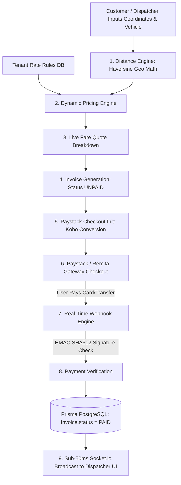

# Logistel Financial Engine: Dynamic Pricing, Invoicing & Payment Architecture

This document defines the complete financial architecture of the **Logistel Logistics Platform**, covering geographical distance calculations, multi-tenant rate configurations, dynamic shipping fare equations, invoice lifecycle management, Unique Payment References (UPR), and Paystack gateway integration with HMAC SHA512 security.

---

## 1. High-Level Financial Flow



---

## 2. Geographical Distance Engine (`calculateHaversineDistance`)

To calculate dynamic shipping costs accurately, the system computes the exact geographical distance between the pickup `(lat1, lon1)` and dropoff `(lat2, lon2)` using the **Haversine Formula**:

$$\text{Distance (km)} = 2 R \cdot \arctan2\left(\sqrt{a}, \sqrt{1-a}\right)$$

where $R = 6371\text{ km}$ (Earth's mean radius) and:
$$a = \sin^2\left(\frac{\Delta\text{lat}}{2}\right) + \cos(\text{lat}_1) \cdot \cos(\text{lat}_2) \cdot \sin^2\left(\frac{\Delta\text{lon}}{2}\right)$$

### TypeScript Implementation:
```typescript
calculateHaversineDistance(lat1: number, lon1: number, lat2: number, lon2: number): number {
  const R = 6371; // Earth's radius in kilometers
  const dLat = ((lat2 - lat1) * Math.PI) / 180;
  const dLon = ((lon2 - lon1) * Math.PI) / 180;

  const a =
    Math.sin(dLat / 2) * Math.sin(dLat / 2) +
    Math.cos((lat1 * Math.PI) / 180) *
      Math.cos((lat2 * Math.PI) / 180) *
      Math.sin(dLon / 2) *
      Math.sin(dLon / 2);

  const c = 2 * Math.atan2(Math.sqrt(a), Math.sqrt(1 - a));
  const distance = R * c;

  return Math.round(distance * 100) / 100; // Returns rounded km (e.g. 14.25)
}
```

---

## 3. Multi-Tenant Rate Configuration (`PricingRule`)

Each logistics company (Tenant) maintains its own pricing parameters in PostgreSQL (`PricingRule` table).

### Default System Fallbacks:
If a newly onboarded logistics tenant has not configured custom rates, `getOrInitPricingRule` automatically creates default baseline rates:

| Setting | Default Value | Description |
|---|---|---|
| **Base Fare** | ₦1,000 | Baseline fixed booking fee |
| **Per-KM Rate** | ₦100 / km | Charge per kilometer traveled |
| **Bike Multiplier** | `1.0x` | Multiplier for motorcycle deliveries |
| **Car Multiplier** | `1.2x` | Multiplier for sedan/compact deliveries |
| **Van Multiplier** | `1.5x` | Multiplier for cargo van deliveries |
| **Truck Multiplier** | `2.5x` | Multiplier for heavy freight truck deliveries |

---

## 4. Dynamic Shipping Fare Calculation Equation

The total fare quote is calculated dynamically using the following formula:

$$\text{Total Fare (₦)} = \text{Math.round}\Big(\big(\text{Base Fare} + (\text{Distance (km)} \times \text{Per-KM Rate})\big) \times \text{Vehicle Multiplier}\Big)$$

### Example Calculation:
- **Pickup to Dropoff Distance**: $15.0\text{ km}$
- **Tenant Per-KM Rate**: ₦$120\text{/km}$
- **Base Fare**: ₦$1,000$
- **Selected Vehicle**: Cargo Van (`1.5x` multiplier)

$$\text{Subtotal} = 1000 + (15.0 \times 120) = 1000 + 1800 = ₦2,800$$
$$\text{Total Fare} = \text{Math.round}(2800 \times 1.5) = ₦4,200$$

---

## 5. Unique Payment Reference (UPR) Strategy

To support multi-channel payments (Card, Bank Transfer, USSD, POS, Over-The-Counter), Logistel implements a **Unique Payment Reference (UPR)** engine:

$$\text{Format: } \mathbf{LOG-\text{\{TENANT\_CODE\}}-\text{\{YYMM\}}-\text{\{UNIQUE\_HEX\}}$$

**Examples**:
- **Delivery Invoice**: `LOG-APEX-2608-D78F29`
- **Tenant Subscription**: `LOG-SUB-2608-T99A10`

### Benefits:
- **No Manual Proof Uploads**: Eliminates customers uploading manual bank alert screenshots.
- **Instant Automated Reconciliation**: Matches payment payloads from Paystack or Remita directly to `Invoice.paymentReference`.
- **Sub-50ms Socket Broadcast**: Upon payment settlement, WebSockets broadcast an `invoice_paid` event to update the live dispatcher dashboard without requiring page refresh.

---

## 6. Paystack Gateway Integration & Security Engine

### A. Checkout Session Initialization (`initializePaystackCheckout`)
- Converts Naira amounts to Kobo (`amountInNaira * 100`).
- Transmits metadata (`tenantId`, `deliveryId`) to Paystack API (`POST https://api.paystack.co/transaction/initialize`).
- Returns the Paystack `authorization_url`, `access_code`, and `reference`.

### B. HMAC SHA512 Webhook Security (`handlePaystackWebhook`)
To prevent spoofed webhook requests, incoming Paystack webhooks (`POST /api/v1/pricing/webhook`) undergo strict cryptographic validation:

```typescript
if (signature && PAYSTACK_SECRET_KEY !== "sk_test_placeholder") {
  const hash = crypto
    .createHmac("sha512", PAYSTACK_SECRET_KEY)
    .update(JSON.stringify(payload))
    .digest("hex");

  if (hash !== signature) {
    console.warn("⚠️ Invalid Paystack Webhook Signature detected");
    throw new Error("Invalid signature");
  }
}
```

---

## 7. Sandbox Fallback Strategy

For local offline development and automated CI testing, if `PAYSTACK_SECRET_KEY` is not provided or set to `sk_test_placeholder`, the pricing service automatically uses an internal **Sandbox Engine** to simulate successful checkouts and verifications without requiring live API keys or spending real currency.
