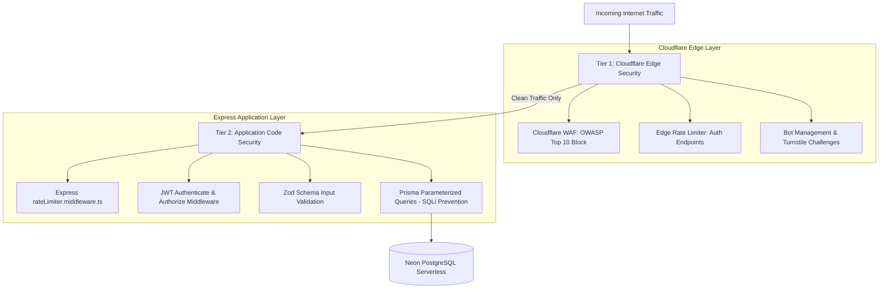

# Logistel Platform Security & Defense Architecture

This document defines the end-to-end security model for the **Logistel Logistics Platform**. It outlines our defense-in-depth approach, covering both **Application-Level Protection** (built inside Node.js/Express) and **Edge-Level Protection** (Cloudflare WAF, Rate Limiting, and Bot Management).

---

## 1. Architecture Overview: Defense-in-Depth

Our security model operates on a two-tier defense strategy:



---

## 2. Threat Matrix & Defense Strategy

| Threat Vector | Attack Scenario | Application Defense (Code) | Edge Defense (Cloudflare WAF) |
|---|---|---|---|
| **Credential Stuffing** | Bots trying 200+ passwords/minute on `/api/v1/auth/login` | `express-rate-limit` blocks IPs after 100 requests per window | **Edge Rate Limiting**: Drops requests at Cloudflare before Node.js spends CPU cycles parsing headers |
| **Database Pool Exhaustion** | High volume of login attempts draining Neon connection pool | Connection timeouts (`connect_timeout=30`) & JWT caching | **Edge Filtering**: Prevents unauthenticated bot traffic from triggering database lookups |
| **Pricing & Route Scraping** | Bots scraping pricing models (`/api/v1/pricing`) or OSRM routes | General API rate limiting | **Bot Fingerprinting**: Challenges headless browsers/scrapers with Turnstile challenges |
| **SQL Injection (SQLi)** | Malicious SQL syntax injected into form fields or query parameters | Prisma ORM uses parameterized queries; raw queries use `$queryRaw` parameters | **WAF Ruleset**: Drops SQL injection payloads at the Cloudflare edge |
| **Cross-Site Scripting (XSS)** | Script injection via recipient names or address inputs | Zod schema string sanitization & React auto-escaping | **WAF Ruleset**: Inspects HTTP bodies for `<script>` or event-handler payloads |
| **Cargo Diversion / Transloading Fraud** | Drivers diverting off-route to steal cargo | **LocationBreadcrumb**: Append-only GPS audit trail logged on every Socket.io ping | Immutable PostgreSQL history allowing post-trip map replay |

---

## 3. Tier 1: Edge-Level Security Rules (Cloudflare Configuration)

When deploying Logistel to production behind Cloudflare (e.g., `api.logistel.com`), the following three rules must be configured in the Cloudflare Dashboard:

### Rule 1: Edge Rate Limiting on Authentication Routes
- **Target Paths**: `/api/v1/auth/login`, `/api/v1/auth/register`, `/api/v1/auth/onboard`
- **Threshold**: Exceeding 5 requests per minute per IP address
- **Action**: **Managed Challenge (Turnstile)** or **Block (HTTP 429)**
- **Purpose**: Prevents credential stuffing and brute-force password guessing without burdening Node.js or Neon DB.

### Rule 2: Bot Management on High-Value Endpoints
- **Target Paths**: `/api/v1/pricing/*`, `/api/v1/tracking/public/*`, `/track`
- **Criteria**: Cloudflare Bot Score `< 30` (Automated scrapers/headless scripts)
- **Action**: **Interactive JavaScript Challenge**
- **Purpose**: Stops competitor scraping bots from harvesting pricing models or route telemetries.

### Rule 3: WAF Custom Rules (OWASP Top 10 Protection)
- **Threat Patterns**: SQL Injection (`select`, `union`, `drop table`), XSS (`<script>`, `javascript:`), Path Traversal (`../..`)
- **Action**: **Block immediately**
- **Purpose**: Filters out malicious payloads at the edge before Express request parsers receive them.

---

## 4. Tier 2: Application-Level Security (Built into Codebase)

Our Express backend incorporates strict defense mechanisms at every layer:

### 1. Rate Limiting Middleware (`rateLimiter.middleware.ts`)
```typescript
import rateLimit from "express-rate-limit";

export const generalApiLimiter = rateLimit({
  windowMs: 15 * 60 * 1000, // 15 minutes
  max: 100, // Limit each IP to 100 requests per window
  message: { status: "error", message: "Too many requests. Please try again later." },
});
```

### 2. JWT Authentication & Tenant Data Isolation (`auth.middleware.ts`)
```typescript
export const authenticate = (req: Request, res: Response, next: NextFunction): void => {
  const authHeader = req.headers.authorization;
  if (!authHeader?.startsWith("Bearer ")) {
    res.status(401).json({ status: "error", message: "Authentication token missing" });
    return;
  }
  const token = authHeader.split(" ")[1];
  const decoded = jwt.verify(token, JWT_SECRET) as { userId: string; role: string; tenantId: string };
  req.user = { id: decoded.userId, role: decoded.role, tenantId: decoded.tenantId, email: decoded.email || "" };
  next();
};
```

### 3. Zod Input Validation (`auth.validator.ts`, `tenant.validator.ts`)
Every incoming payload is strictly parsed against Zod schemas before reaching controller logic, stripping unexpected keys and enforcing type safety.

### 4. Database Security & Connection Resilience (`.env` & Prisma)
- **Parameterized Queries**: Prisma automatically parameterizes inputs, preventing SQL injection.
- **Connection Timeout Handling**: `DATABASE_URL` includes `connect_timeout=30&pool_timeout=30` to handle Neon serverless compute cold-start reconnects gracefully without crashing.

### 5. Append-Only GPS Breadcrumb Audit Trail (`LocationBreadcrumb`)
- Every Socket.io location update from a driver app appends an immutable row to `LocationBreadcrumb`.
- Rows are **never updated or deleted**, guaranteeing an unalterable audit log for cargo theft and diversion investigations.

---

## 5. Production Pre-Launch Security Checklist

Before deploying Logistel to staging or production:

- [x] Prisma parameterized queries enforced (SQLi protected).
- [x] JWT authentication & role-based authorization implemented.
- [x] Zod input validation active on all mutations.
- [x] Append-only GPS breadcrumb logging active for cargo audit.
- [x] Neon database connection timeout configured (`connect_timeout=30`).
- [ ] Configure Cloudflare Rate Limiting rules on `/api/v1/auth/*`.
- [ ] Enable Cloudflare OWASP WAF Managed Ruleset.
- [ ] Set `NODE_ENV=production` and ensure `JWT_SECRET` uses a 256-bit random string.
