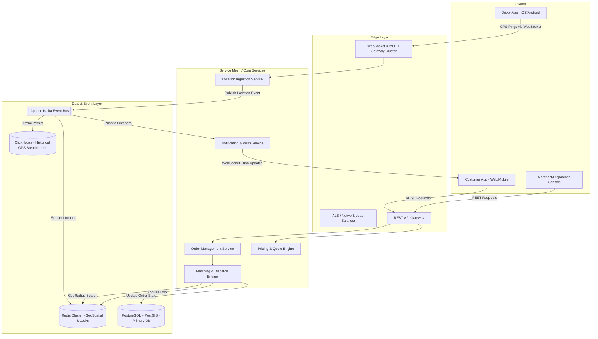
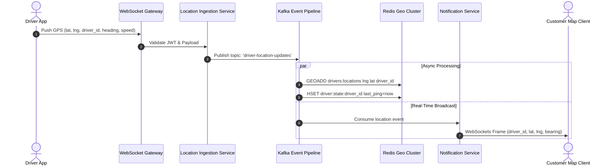
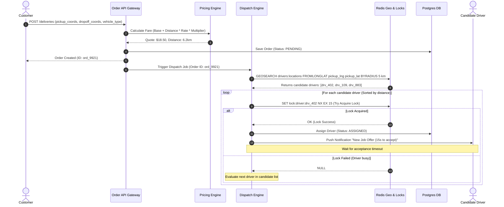
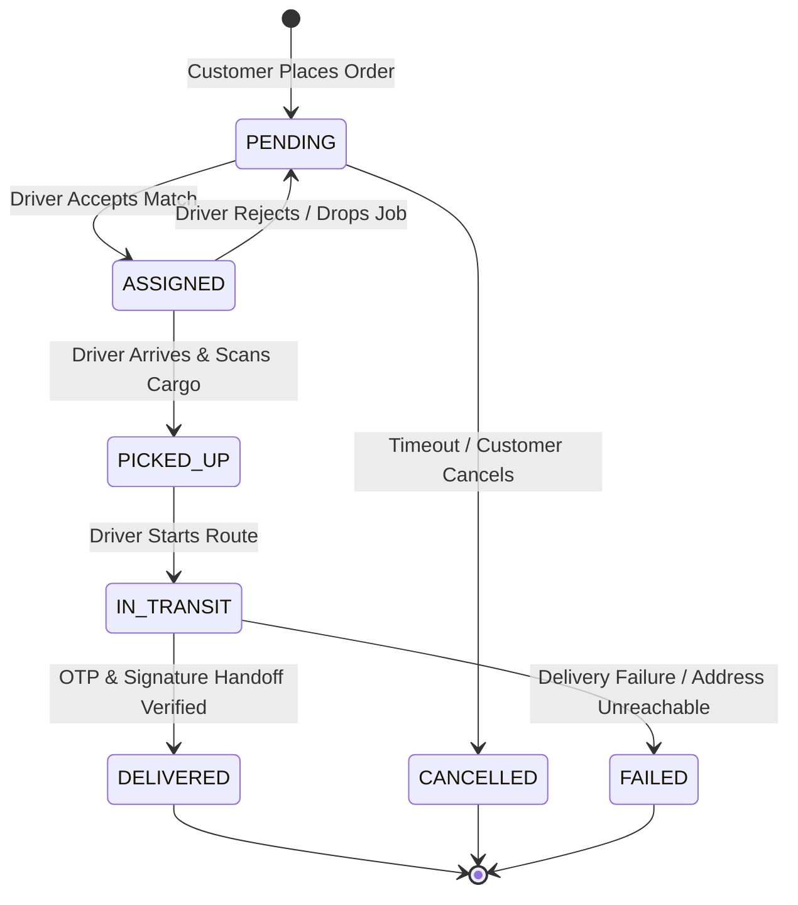

# System Design Interview: Design a Real-Time Delivery Dispatch & Tracking System

> **Interview Target**: Senior / Staff Software Engineer System Design Interview  
> **Topic**: Building a Scalable On-Demand Logistics & Driver Dispatch Platform (Uber Eats / Delivery Hero / GIG Logistics Scale)

---

## 1. Problem Statement & Requirements

Design a scalable, highly available real-time delivery dispatch and tracking system that connects customers, dispatchers, and drivers.

### Functional Requirements
1. **Real-time Location Tracking**: Active drivers emit GPS coordinates every 3-5 seconds. Customers can track driver location live on a map with low latency (<500ms).
2. **Order Placement & Fare Estimation**: Customers can request a delivery quote based on pickup/dropoff coordinates and vehicle type, then place an order.
3. **Automated Driver Matching & Dispatch**: The system automatically locates the top $N$ optimal available drivers within a radius (e.g., 5 km) and offers the job sequentially or concurrently with optimistic/pessimistic locking.
4. **Order Status Lifecycle**: Track states (`PENDING`, `ASSIGNED`, `PICKED_UP`, `IN_TRANSIT`, `DELIVERED`, `CANCELLED`).
5. **Proof of Delivery (POD)**: Handoff verification via OTP and digital signature / photo uploads.

### Non-Functional Requirements
1. **High Availability**: 99.99% uptime for location streaming and order matching.
2. **Low Latency**: Location updates delivered to customer maps within **<500ms**.
3. **Scalability**: Handle **100,000 active drivers** emitting location pings every 5 seconds.
4. **Data Integrity & Consistency**: Prevent double-booking (two dispatchers/orders matching the exact same driver simultaneously).

---

## 2. Back-of-the-Envelope Estimation

* **Active Drivers**: $100,000$ concurrent drivers.
* **Location Frequency**: $1$ update per driver every $5$ seconds.
* **Location Write QPS**:
  $$\text{Write QPS} = \frac{100,000 \text{ drivers}}{5 \text{ seconds}} = 20,000 \text{ QPS (Writes)}$$
* **Peak Write QPS**: $2\times \text{Average} = 40,000 \text{ QPS}$.
* **Active Customers Tracking**: $200,000$ active customer map views listening to updates.
* **Payload Size**: `driver_id` (16B), `lat` (8B), `lng` (8B), `status` (4B), `timestamp` (8B) $\approx 44\text{ Bytes}$.
* **Ingestion Network Bandwidth**:
  $$20,000 \text{ QPS} \times 500 \text{ Bytes (TCP/HTTP overhead)} \approx 10 \text{ MB/s} \text{ (80 Mbps)}$$

---

## 3. High-Level Architecture



---

## 4. Flow Diagrams & Deep Dives

### Flow Diagram 1: Real-Time GPS Location Ingestion Pipeline

This pipeline ingests 20,000+ GPS updates per second from drivers, updates spatial caches, and broadcasts live positions to tracking clients with sub-200ms latency.



---

### Flow Diagram 2: Automated Order Dispatch & Driver Matching Workflow

This process handles order placement, calculates distance/fare, queries Redis Geospatial for candidate drivers, acquires a distributed lock to prevent double-booking, and notifies the driver.



---

### Flow Diagram 3: Delivery State Machine Lifecycle



---

## 5. Database Schema & Data Models

### 1. Primary Database (PostgreSQL + PostGIS)

#### `tenants` Table
```sql
CREATE TABLE tenants (
    id UUID PRIMARY KEY DEFAULT gen_random_uuid(),
    company_name VARCHAR(100) NOT NULL,
    subdomain VARCHAR(50) UNIQUE NOT NULL,
    created_at TIMESTAMP WITH TIME ZONE DEFAULT CURRENT_TIMESTAMP
);
```

#### `pricing_rules` Table
```sql
CREATE TABLE pricing_rules (
    id UUID PRIMARY KEY DEFAULT gen_random_uuid(),
    tenant_id UUID REFERENCES tenants(id) ON DELETE CASCADE UNIQUE,
    base_fare NUMERIC(10, 2) NOT NULL DEFAULT 1000.00,
    per_km_rate NUMERIC(10, 2) NOT NULL DEFAULT 100.00,
    bike_multiplier NUMERIC(4, 2) NOT NULL DEFAULT 1.00,
    car_multiplier NUMERIC(4, 2) NOT NULL DEFAULT 1.20,
    van_multiplier NUMERIC(4, 2) NOT NULL DEFAULT 1.50,
    truck_multiplier NUMERIC(4, 2) NOT NULL DEFAULT 2.50,
    updated_at TIMESTAMP WITH TIME ZONE DEFAULT CURRENT_TIMESTAMP
);
```

#### `deliveries` Table
```sql
CREATE TABLE deliveries (
    id UUID PRIMARY KEY DEFAULT gen_random_uuid(),
    tenant_id UUID NOT NULL REFERENCES tenants(id),
    customer_id UUID NOT NULL,
    driver_id UUID REFERENCES drivers(id),
    status VARCHAR(20) NOT NULL DEFAULT 'PENDING',
    pickup_address TEXT NOT NULL,
    pickup_location GEOMETRY(Point, 4326) NOT NULL,
    dropoff_address TEXT NOT NULL,
    dropoff_location GEOMETRY(Point, 4326) NOT NULL,
    delivery_otp VARCHAR(6) NOT NULL,
    signature_url TEXT,
    pod_photo_url TEXT,
    created_at TIMESTAMP WITH TIME ZONE DEFAULT CURRENT_TIMESTAMP
);

CREATE INDEX idx_deliveries_tenant_status ON deliveries(tenant_id, status);
CREATE INDEX idx_deliveries_pickup_geo ON deliveries USING GIST(pickup_location);
```

---

### 2. Redis Data Structures (In-Memory & Ephemeral)

1. **Driver Geolocation Index**:
   - Key: `drivers:locations:<tenant_id>`
   - Type: `GEO` (Uses Spatial Indexing via Geohash)
   - Command: `GEOADD drivers:locations:t1 3.3792 6.5244 "driver_101"`
   - Querying: `GEOSEARCH drivers:locations:t1 FROMLONGLAT 3.3792 6.5244 BYRADIUS 5 km WITHDIST`

2. **Distributed Driver Lock (Prevents Double Booking)**:
   - Key: `lock:driver:<driver_id>`
   - Command: `SET lock:driver:driver_101 "ord_9921" NX EX 15`

---

## 6. Key Design Trade-Offs & Deep Dive Questions

> [!NOTE]
> **Important Distinction: Your Current Application vs. Enterprise System Design Interview**
> * **In Your Current App**: Breadcrumbs are stored in **PostgreSQL via Prisma** (`LocationBreadcrumb` table). This is simple, relational, and perfect for standard operational loads.
> * **In a High-Scale Interview**: Interviewers test how you scale to $100,000+$ active drivers emitting GPS every 3 seconds ($20,000+$ inserts/sec). Relational databases like PostgreSQL hit IOPS bottlenecks under continuous append-only writes. Therefore, enterprise platforms (like Uber or Delivery Hero) stream pings into **ClickHouse or Cassandra**.

### Q1: How do you handle 40,000 GPS Writes/sec without overwhelming the primary database?
* **Answer**: We separate **ephemeral real-time state** from **persistent transactional state**.
  * Real-time driver coordinates are ephemeral (they expire quickly). We stream them into **Kafka** and store only the latest coordinate in a **Redis Cluster using `GEOADD`**.
  * Historical breadcrumbs are batch-written asynchronously into a time-series column store (e.g., **ClickHouse** or **Cassandra**), completely bypassing PostgreSQL. PostgreSQL only stores permanent order milestones (`PICKED_UP`, `DELIVERED`).

### Q2: How do you prevent double-booking when multiple orders attempt to match the same driver?
* **Answer**: We enforce distributed locking via **Redis Redlock** / atomic `SETNX` commands. When the Dispatch Service selects driver `D1` for order `O1`, it attempts `SET lock:driver:D1 O1 NX EX 15`. If successful, the driver is offered the job. If another order `O2` tries to claim `D1` simultaneously, `SETNX` returns `0`, and `O2` immediately falls back to the next closest driver `D2`.

### Q3: What happens if a driver loses internet connection mid-delivery?
* **Answer**: 
  * The Driver App stores GPS pings locally in an IndexedDB / SQLite queue while offline.
  * When connection restores, the app bulk-flushes missed pings with original timestamps.
  * The Notification Engine uses **Heartbeat Monitoring**: If no ping is received for 45 seconds, the driver's state in Redis flips to `OFFLINE`, and active dispatches are automatically reassigned.

---

## 7. Architectural Checklist for Candidates

| Architecture Goal | Solution Implemented |
| :--- | :--- |
| **Low Latency Map Updates** | WebSockets + Event Streaming via Kafka & Redis Pub/Sub |
| **High Density Spatial Search** | Redis Geospatial Index (`GEOSEARCH`) |
| **Concurrency Protection** | Distributed Locks using Redis `SETNX` / Redlock |
| **Heavy Traffic Isolation** | Event-driven decoupled microservices (Ingestion separate from Order Management) |
| **Analytics & Breadcrumb History** | ClickHouse / Cassandra append-only time series DB |
