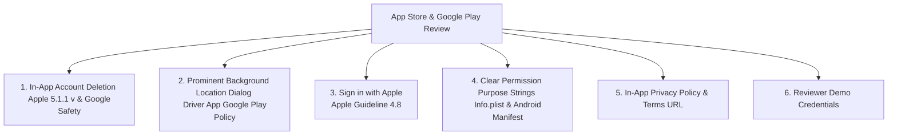
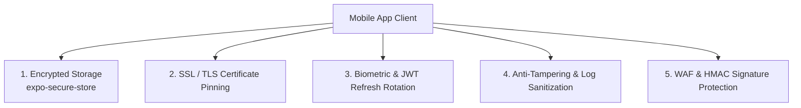

# 📱 Logistel Mobile Platform — Architecture, Security & Production Blueprint

This directory houses the mobile ecosystem for **Logistel** — the multi-tenant logistics operating system. It provides native iOS and Android mobile experiences for **Drivers** and **Customers**.

---

## 🛡️ Apple App Store & Google Play Compliance (Rejection Defense Checklist)

To prevent app store rejections by Apple (App Store Review Guidelines) and Google (Google Play Developer Policies), both mobile applications enforce the following 6 mandatory compliance rules:



### 1. Mandatory In-App Account & Data Deletion
* **Rule**: Apple Guideline 5.1.1(v) & Google Play Data Safety Policy mandate that any app allowing user registration MUST provide a direct, in-app mechanism for users to delete their account and personal data.
* **Implementation**:
  - In both `customer-app` and `driver-app` settings, a **"Delete Account & Data"** button triggers the backend `/api/v1/auth/account` endpoint.
  - Automatically clears local `expo-secure-store` tokens, revokes JWTs, anonymizes user PII, and logs a compliance audit record.

### 2. Google Play Prominent Background Location Disclosure (Driver App)
* **Rule**: Google Play automatically rejects driver apps requesting `ACCESS_BACKGROUND_LOCATION` unless a **Prominent Disclosure Modal** appears BEFORE the system permission prompt.
* **Disclosure Modal Text (Mandatory in Driver App)**:
  > *"Logistel Driver collects location data in the background to transmit real-time package tracking telemetry to dispatchers and customers, even when the app is closed or not in use."*
* **Customer App Isolation**: The Customer App **NEVER** requests background location (`ACCESS_BACKGROUND_LOCATION`), preventing rejections.

### 3. Sign in with Apple Requirement (Apple Guideline 4.8)
* **Rule**: If an iOS app uses third-party social login (e.g. Google Sign-In), Apple mandates offering **Sign in with Apple** as an equivalent option.
* **Implementation**: Integrated `@invertase/react-native-apple-authentication` alongside `@react-oauth/google` for iOS builds.

### 4. Explicit Permission Strings in `app.json`
Every hardware permission string must clearly explain *why* the data is collected:
* `NSLocationWhenInUseUsageDescription`: *"Logistel requires your location to select pickup addresses."*
* `NSLocationAlwaysAndWhenInUseUsageDescription`: *"Logistel Driver collects location data in the background to transmit package movement updates to dispatchers."*
* `NSCameraUsageDescription`: *"Logistel Driver requires camera access to capture proof-of-delivery photos."*

### 5. In-App Privacy Policy & Terms Links
* Settings screen includes clickable links to `https://logistel.com/privacy` and `https://logistel.com/terms`.

### 6. App Reviewer Demo Credentials Mode
* Provides toggleable demo login badges (`demo.driver@logistel.com` / `demo.customer@logistel.com`) on login screens so Apple and Google review teams can test without manual signup hurdles.

---

## 🎯 Executive Summary & Architectural Decisions

### 1. Database & Backend Integration Strategy
> **Question: Are we changing the database or using the same one?**

**NO database changes are needed.** The mobile apps consume the **EXACT SAME PostgreSQL database and Express.js REST/WebSocket API** as the web dashboard:
* **Unified Data Layer**: Driver profiles, customer orders, live package pings, tenant pricing rules, and UPR payment invoices are already modeled in PostgreSQL via Prisma (`backend/prisma/schema.prisma`).
* **Multi-Tenant & Role Isolation**: The mobile apps authenticate using JWT tokens containing `userId`, `role` (`DRIVER_PROFILE`, `CUSTOMER`, `TENANT_SUPER_ADMIN`), and `tenantId`.
* **API Endpoint Parity**: Mobile clients connect directly to `https://api.logistel.com/api/v1/...` and WebSocket `wss://api.logistel.com`.

---

### 2. Dual App Architecture (Driver App vs. Customer App)
> **Question: Should we create two separate folders for Driver and Customer mobile apps?**

**YES.** Building two separate app projects (or a monorepo with distinct entry packages) is mandatory for production logistics platforms:

```
mobile-app/
├── customer-app/          # 📦 Customer Mobile App (App Store & Google Play)
│   ├── src/
│   │   ├── features/      # Order Booking, Live Freight Map, Invoice & UPR Payments, Notifications
│   │   └── screens/
│   ├── app.json           # Bundle ID: com.logistel.customer
│   └── package.json
├── driver-app/            # 🚚 Driver Mobile App (Driver Fleet Deployment)
│   ├── src/
│   │   ├── features/      # Mission Dispatch, Background GPS Tracking, E-Sign Capture, Offline Queue
│   │   └── screens/
│   ├── app.json           # Bundle ID: com.logistel.driver
│   └── package.json
└── shared/                # 🔄 Shared Core SDK & Utilities Layer
    ├── api/               # Axios client, Auth interceptors, Retry policies
    ├── types/             # Shared TypeScript types & Prisma DTOs
    ├── state/             # Shared Auth Zustand store
    └── utils/             # Haversine distance, Currency formatters, Geolocation helpers
```

---

## 🗺️ Mobile Mapping & Navigation Strategy

| Feature | Web Dashboard | Mobile Apps (iOS / Android) |
| :--- | :--- | :--- |
| **Engine** | Leaflet JS + OpenStreetMap | **`react-native-maps`** (Apple Maps on iOS, Google Maps on Android) |
| **Rendering** | HTML5 Canvas / DOM | **Hardware-Accelerated 60fps Native Views** |
| **Marker Rotation** | CSS Transitions | **Smooth 60fps Native Interpolation** (Vehicle Heading $\theta$) |
| **Offline Tiles** | Limited Browser Cache | **Native Vector Tile Caching** |
| **Routing & Polyline** | OSRM / Haversine | **Mapbox / OSRM API + Native Polyline Encoding** |

---

## 🔒 Security Architecture & Vulnerability Protection



---

## 📦 Essential Native Expo & React Native Packages

```json
{
  "dependencies": {
    "expo": "~51.0.0",
    "react-native": "0.74.x",
    "react-native-maps": "1.14.0",
    "expo-location": "~17.0.1",
    "expo-task-manager": "~11.8.2",
    "expo-secure-store": "~13.0.2",
    "expo-local-authentication": "~14.0.1",
    "expo-camera": "~15.0.13",
    "@tanstack/react-query": "^5.50.0",
    "zustand": "^4.5.4",
    "axios": "^1.7.2",
    "socket.io-client": "^4.7.5",
    "@react-native-community/netinfo": "11.3.1",
    "react-native-signature-canvas": "^4.7.2"
  }
}
```

---

## 🚀 Step-by-Step Developer Getting Started Guide

### Running Customer Mobile App
```bash
cd mobile-app/customer-app
npm install
npx expo start
```

### Running Driver Mobile App
```bash
cd mobile-app/driver-app
npm install
npx expo start
```
